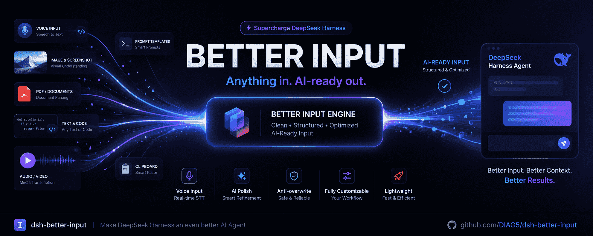

<p align="center">
  
</p>

<h1 align="center">🎤 dsh-better-input</h1>

<p align="center"><b>给 DeepSeek Harness 的智能体换一副更顺手的「输入」。</b></p>

<p align="center">
  开源输入体验增强插件 · BetterInput for your DeepSeek Harness agent
</p>

<p align="center">
  <a href="./README.en.md">English</a> · <a href="./README.md">简体中文</a>
</p>

<p align="center">
  <a href="https://www.npmjs.com/package/dsh-better-input"></a>
  <a href="https://www.npmjs.com/package/dsh-better-input"></a>
  <a href="https://shields.io"></a>
  
  <a href="./LICENSE"></a>
  <a href="https://github.com/DIAG5/dsh-better-input/stargazers"></a>
</p>

> 💡 **它解决什么？** 与智能体对话，输入不只靠键盘打字。BetterInput 是一套**输入增强套件**：从语音识别、AI 润色、提示词一键优化，到把 PDF / DOCX / PPT / XLSX 等各类文件转成结构清晰的 Markdown，再到交互细节都打磨的体验优化——**把每一种「喂给智能体的输入」都变得更顺更省心**。

***

## ✨ 目前已实现

<table>
<tr><th align="center" width="120">模块</th><th align="left">说明</th></tr>
<tr>
<td align="center">🎙️<br/><b>语音输入</b></td>
<td>点击麦克风，边说边转写，文字<strong>实时流式</strong>进入输入框。浏览器原生识别，<strong>无需 API Key</strong>。</td>
</tr>
<tr>
<td align="center">🤖<br/><b>AI 润色</b></td>
<td>识别后自动清理：去口头禅、修同音错字（根木鹿→根目录、脱肯→Token）、补标点、把口语列举转成编号列表。<strong>复用 dsh 已配置的模型，无需额外 Key</strong>。</td>
</tr>
<tr>
<td align="center">✨<br/><b>提示词优化</b></td>
<td>输入框右上角一个图标，AI 帮你把写好的提示词优化得更精准；点击后弹出<strong>原文 / 优化结果对比</strong>，确认满意再采用。复用 dsh 模型，无需额外 Key。</td>
</tr>
<tr>
<td align="center">🧠<br/><b>思考强度控制</b></td>
<td>润色 / 优化各自可独立选择推理档位，<strong>默认关闭思考</strong>（模型支持 `off` 档则显式关闭，不产生思考过程），也可手动选更高档位。</td>
</tr>
<tr>
<td align="center">🐘<br/><b>防覆盖保护</b></td>
<td>润色进行中你手动改了草稿，结果<strong>不会覆盖</strong>你的编辑；失败保留原文。</td>
</tr>
<tr>
<td align="center">🔄<br/><b>更新检查</b></td>
<td>设置页底部「<strong>关于与更新</strong>」一键检测 npm 最新版，发现新版会给出<strong>一键复制更新命令</strong>，让你及时跟进修复与新功能。</td>
</tr>
<tr>
<td align="center">⏱️<br/><b>录音自动停止</b></td>
<td>可自定义单次录音上限（1–600 秒），不占麦克风。</td>
</tr>
<tr>
<td align="center">⚙️<br/><b>可视化设置页</b></td>
<td>识别语言、录音时长、语音润色开关、以及润色 / 优化的<strong>模型、思考强度、自定义提示词</strong>，全部可在设置里配置；内置提示词可一键展开查看。默认已开启并自动选中主模型。</td>
</tr>
</table>

## 🗺️ 下一步（输入增强的方向）

BetterInput 的目标是成为一套完整的**输入体验增强套件**。语音只是开始，接下来围绕"让喂给智能体的每一个输入都更顺"逐步展开：

### 文字 & 提示词

- [x] ✨ **提示词优化** — 输入框旁点一个图标，AI 帮你润色/优化写好的提示词，让提问更能命中
- [ ] 📝 **提示词模板库** — 一键插入常用模板（写代码 / 总结 / 翻译 / 角色扮演…）
- [ ] 🧹 **文本清洗** — 粘贴乱码 / 带行号 / 时间戳的文本，自动整理成干净正文
- [ ] 🔤 **即时翻译** — 写中文一键转英文给 AI（或反之）
- [ ] 📋 **智能粘贴** — 粘贴自动识别是代码 / 表格 / URL / 引用，智能包裹成合适格式

### 媒体 & 文件

> 📷 图片输入：**DSH** **`rc.8`** **起已原生支持**。DeepSeek API 已原生支持图片输入，**不再提供图片相关的插件功能**。

- [ ] 🧾 **PDF 转结构化** — PDF → AI 友好的易读格式（Markdown / 纯文本）
- [ ] 🎬 **音视频转写** — 粘贴本地音视频文件 → 转成文字（语音输入的进阶）

### 效率 & 协作

- [ ] ⏱️ **草稿恢复** — 上次没发完的草稿自动保存，随时恢复
- [ ] 🧮 **变量填充** — 输入框里用 `{{日期}}`、`{{当前目录}}` 等变量自动替换
- [ ] 📎 **快捷输入流** — 日报 / 周报等固定模板一键发送

> 以上按主题规划，会持续迭代。**有想法欢迎提** **[Issue](https://github.com/DIAG5/dsh-better-input/issues)** **/ PR**，一起把它做成更好的输入套件。

## 🚀 安装

前置：[DeepSeek Harness](https://github.com/deepseek-ai/deepseek-harness)（`>= 0.1.0-rc.8`）+ Node.js `^22.19.0 || >=24.0.0` + Chrome/Edge 浏览器。

> 💡 **两种方式，任选其一。** 装过 `dsh` CLI 的用短命令；没装或不想全局安装的，用下方 **npx 全称**——**不需要任何全局环境配置**。已发布到 [npm](https://www.npmjs.com/package/dsh-better-input)。

### 方式 A：有全局 `dsh` CLI

```sh
# 从 npm 安装（推荐）
dsh plugin --profile web add dsh-better-input

# 或从 GitHub 仓库安装
dsh plugin --profile web add github:DIAG5/dsh-better-input

# 卸载
dsh plugin --profile web remove dsh-better-input
```

### 方式 B：没有 `dsh`，或不想全局安装（npx 全称）

下面的命令用 `npx` 直接运行 dsh CLI，**不写入全局环境**，临时拉取即可用：

```sh
# 从 npm 安装（推荐）
npx -y @deepseek-ai/dsh plugin --profile web add dsh-better-input

# 或从 GitHub 仓库安装
npx -y @deepseek-ai/dsh plugin --profile web add github:DIAG5/dsh-better-input

# 卸载
npx -y @deepseek-ai/dsh plugin --profile web remove dsh-better-input
```

> `-y` 表示自动确认下载；首次运行会拉取 dsh CLI，之后有 npx 缓存。

### 从源码安装（开发）

```sh
git clone https://github.com/DIAG5/dsh-better-input.git
cd dsh-better-input
npm install
npm run build
# 有全局 CLI：
dsh plugin --profile web add "$PWD"
# 没有全局 CLI：
npx -y @deepseek-ai/dsh plugin --profile web add "$PWD"
```

### 备选：不装依赖，写进 preset 的 `cordis.yml`

如果你已经在用某个 agent preset，只需要加一行（无需跑安装命令）：

```yaml
- insert:
    - id: dsh-better-input
      name: dsh-better-input
```

安装后刷新 Web UI，输入框右侧会出现**麦克风图标** 🎤。

## 📖 使用

### 1. 语音输入

1. 打开任意对话，点击输入框右侧的**麦克风按钮**
2. 开始说话，识别文字**实时流入**输入框
3. 再点按钮（或识别条上的**停止**）结束
4. 检查、修改、发送

> 识别完全在浏览器本地完成（Web Speech API），无需 API Key、无服务器往返。Firefox/Safari 不支持时按钮自动禁用。

### 2. AI 润色

设置 → **BetterInput** → 打开 **AI 润色** → 选择一个 dsh 里已配置的模型。

内置提示词会：去口头禅、修 ASR 同音错字、补标点、把口语列举转成编号列表（如「第一…第二…」→ `1.` `2.`）。留空用内置提示词，点「查看内置提示词」可展开原文；或粘贴自定义提示词（总会追加输出契约保护，保证只返回正文、不答非所问）。

### 3. 提示词优化

1. 在输入框里写好你的提示词
2. 点击输入框右上角的 **✨ 优化** 图标
3. 稍等，弹出**原文 / 优化结果对比**画面
4. 点 **采用** 用优化结果替换草稿，或点 **取消** 保留原文

> 默认关闭思考，追求快速、低成本的直出结果。从设置页可手动提高思考强度以获得更深层的优化。

### 4. 检查更新

1. 打开设置 → **BetterInput** → 拉到最底部「**关于与更新**」分节
2. 点击「**检查更新**」
3. 若发现新版本，会显示 `当前版本 → 最新版本`，并给出更新命令
4. 在终端执行更新命令即可升级（按你的安装方式**二选一**）：
   - 已全局安装 dsh CLI：
     ```sh
     dsh plugin --profile web update dsh-better-input
     ```
   - 未全局安装，改用 npx：
     ```sh
     npx -y @deepseek-ai/dsh plugin --profile web update dsh-better-input
     ```

> 说明：DSH 不会在你进入时自动更新第三方插件，需手动执行上面命令才会拉到新版。这个分节就是帮你及时发现并跟进更新。

### 5. 设置

| 设置项      | 说明                                   |
| -------- | ------------------------------------ |
| 识别语言     | 留空自动跟随浏览器语言（如 `zh-CN`、`en-US`）       |
| 单次录音上限   | 1–600 秒，默认 120，到点自动停止                |
| AI 润色    | 开/关；开启后每次语音识别结束自动润色进草稿               |
| 润色模型     | 选择 dsh 已配置的模型路由                      |
| 润色思考强度   | 默认关闭思考；可选模型支持的更高档位                   |
| 自定义润色提示词 | 可选，替换内置提示词                           |
| 提示词优化    | 开/关；开启后输入框右侧显示 ✨ 按钮                  |
| 优化模型     | 选择 dsh 已配置的模型路由                      |
| 优化思考强度   | 默认关闭思考；可选模型支持的更高档位                   |
| 自定义优化提示词 | 可选，替换内置优化提示词                         |
| 关于与更新    | 显示当前版本 / 许可证 / 仓库，一键「检查更新」获取最新版与更新命令 |

> 润色与优化的模型、思考强度、提示词相互独立，可各自配置。

## 🧩 兼容性

- DeepSeek Harness `>= 0.1.0-rc.8`
- Node.js `^22.19.0 || >=24.0.0`
- Chromium 内核浏览器（Chrome / Edge）

## 🛠️ 开发

```sh
npm install
npm run check    # 类型检查
npm run build    # 构建 lib/（Host ESM + 浏览器 bundle）
```

改 Client 端：`npm run dev:watch` 后刷新 UI；改 Host 端：重启 dsh web。

## 🏗️ 架构

- `src/index.ts` — Host 插件入口，挂载润色服务
- `src/polish/service.ts` — `BetterInputPolishService`（Typert remote）：设置、dsh 模型路由发现、LLM 润色与提示词优化（复用 `ctx.llm`）
- `src/about.ts` — 插件身份读取与 npm 版本检查（「关于与更新」）
- `src/client/` — 浏览器端：麦克风按钮/优化按钮（`conversation.input.right`）、识别条（`conversation.input.dock`）、设置页（`settings.section`）
- `src/typert.ts` / `src/remote.ts` — Client↔Host 类型化通信契约

## 📄 License

[MIT](./LICENSE)

***

## ⭐ 支持

这个插件正在从「语音」走向「完整的输入增强套件」——觉得它值得期待？

- 点个 **Star ⭐**（你的收藏就是持续迭代的动力）
- 提交 [Issue](https://github.com/DIAG5/dsh-better-input/issues) / [PR](https://github.com/DIAG5/dsh-better-input/pulls)
- 分享给同样用 DSH 的朋友

感谢你的支持 ❤️
